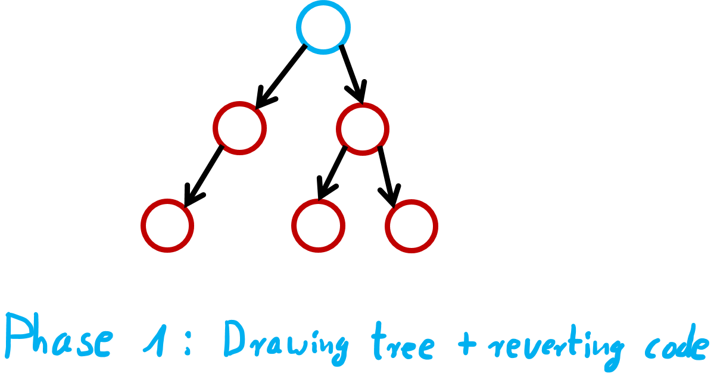
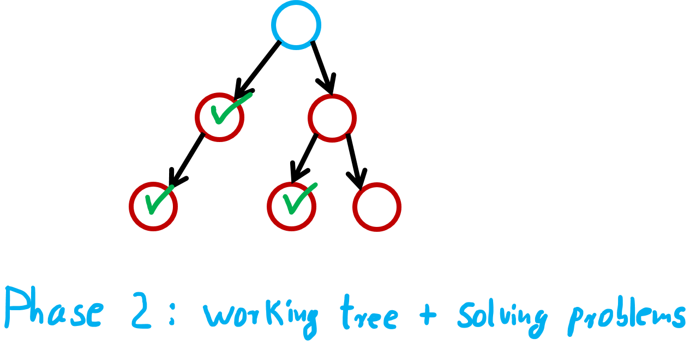

This is a set of processes and tips for dealing with legacy code. Often, these codebases have to be changed either by adding more functionality or refactoring. These changes often introduce errors. This is why testing them somehow is a great idea. Often, writing JUnit tests is not a viable option because of the structure of the codebase. This is where the following techniques come into play.

#Sprout Methods
- legacy system often without tests
- introducing new functionality only with tests!
- => new functionality in the form of new methods ("sprout methods") or new classes ("sprout classes") that are developed using TDD

#Golden Master

- important goal: safety! Under no circumstances would you want to change the behavior of the code
- hence: test coverage provides a "flashing red light" if you accidentally change behavior
 - what if no good test coverage existent? Often not possible to write good JUnit tests
 - solution: Golden Master
 - general idea: not use insight into implementation, but use behavior of code
 - implementation: (if you haven't already) use a (local) Git repository. Tag the current code version as "Golden Master". Now you can add commits as you like, jumping back to the Golden Master if necessary. 
 
 ##usage
 1. write some kind of execution for the part of code under test. Can be a small program or a JUnit test
 2. create snapshot of output, save as template
 3. refactor code step by step. After every step compare output of refactored code to template 
 4. whatever you do: output of changed code must match template! So revert if necessary

 ##possible problems
- code under test doesn't produce output. Maybe introduce log statements.
- code under test produces non-deterministic output. See ugly trivia game: Rolls are randomized. Solution: taking control of random number generator and seeding it with same numbers every time.    
- code under test too complex to generate templates for every input. Solution: sampling. Use a few of the many possible inputs. Example: method that operates on an integer => test with -1, 0, 1, 1.000. Greater number of samples = greater trust in samples. Importance of the code should match number of samples. Better go slow with many samples than be fast and fail. 

## Example
- Adrian Bolboaca, see package ep_2_golden_master
- Article [Surviving Legacy Code with Golden Master and Sampling](http://blog.thecodewhisperer.com/permalink/surviving-legacy-code-with-golden-master-and-sampling/), chapter "The techniques in action": Create multiple Golden Masters for Ugly Trivia Game: Start at [this commit](https://github.com/jbrains/SurvivingLegacyCode-solutions/tree/110dc1308c05a7c43a1d991c66f7dae7633e921a) and read the commits added later. Also, note how tiny and easy to understand these commits are.
- interesting addition by [Falk Sippachs talk at Java Forum Nord 2016](http://www.oio.de/m/konf/vortraege/JavaForumNord2016-TestDrivenLegacyCodeRefactoring-FalkSippach.pdf): Don't alter code under test to create Golden Master. Use test infrastructure:
 
    ```java
    class X {
    
        @Before
        public void init() {
            originalSysOut = System.out;
            consoleStream = new java.io.ByteArrayOutputStream();
            java.io.PrintStream printStream = new PrintStream(consoleStream);
            System.setOut(printStream);
        }
  
        @Test
        public void testSimpleOutput() {
            System.out.println("Hello folks!");
            System.out.println("Hello programmer!");
            assertEquals("Hello folks!\r\rHello programmer!", consoleStream.toString());
      }
  
      @After
      public void teardown() {
            System.setOut(originalSysOut);  
      }
    }
    ```

##Compare output
- text editors like notepad++ with [compare-plugin](https://sourceforge.net/projects/npp-compare/) (download and extract zip, in Notepad++ Settings -> Import -> Import Plugin)
- automated (for example) by saving golden master template into file and parse it using a JUnit test

#Mikado Method
##Problem


Problem: a simple refactoring ...


... leads to another necessary refactoring



That way, a tree of dependent refactorings is created 

Solution: only handle one issue at a time

## Algorithm
1. attempt refactoring
2. run into some issue
3. write down information about issue in a graph (first refactoring = parent, new issue = child)
4. revert all changes
5. beginn refactoring issue => 1. step 
6. repeat until all issues are doable (= leaves of the graph)
7. refactor issues from leaves to the root of the graph



With this algorithm, the tree will be resolved by doing one tiny refactoring after the other, ...


... until the first refactoring can be implemented without problems. 


##Tipps
- (huge) Mikado graph can be processed over time instead of in one huge leap. Attention: Too much time = possible changes in graph due to changed codebase 

#Sources
- [1st Darmstädter Legacy Code Retreat](http://letsdeveloper.com/2015/03/1st-darmstadter-legacy-code-retreat/)
- [Surviving legacy code with Golden Master and Sampling](http://blog.thecodewhisperer.com/permalink/surviving-legacy-code-with-golden-master-and-sampling/)
- Stefan Lieser "Die Mikado Methode" ([youtube](https://www.youtube.com/watch?v=qtIGDc6LTls))
- Talks by [Falk Sippach](http://blog.oio.de/author/sippsack/)
